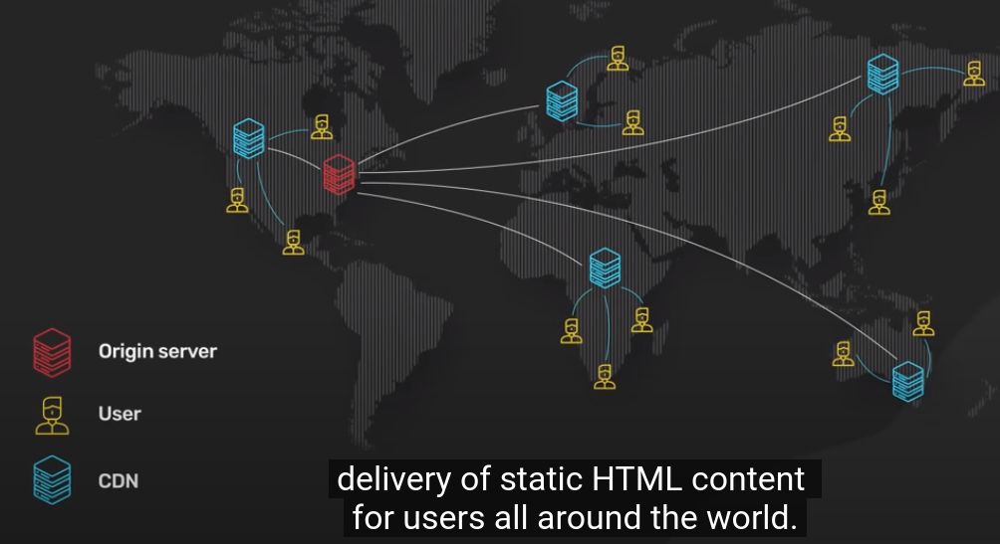
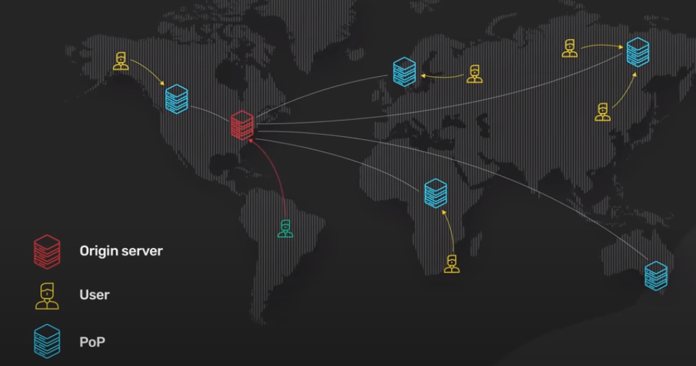
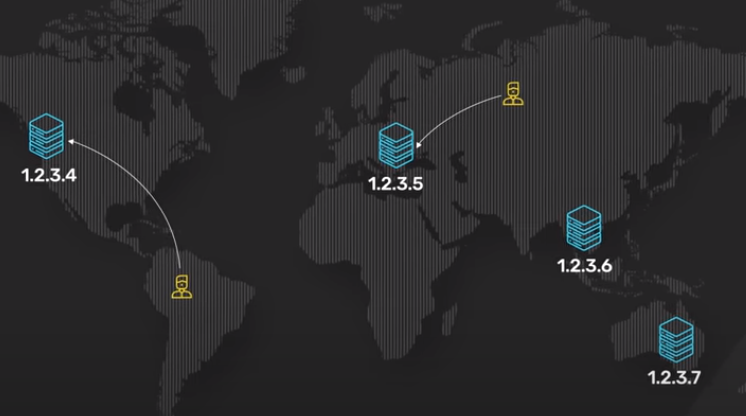

# CDN

## Contents

- [History](#history)
  - [Modern CDN](#modern-cdn)
  - [CDN Technology?](#technology)
  - [DNS-based routing](#dns-routing)
  - [Anycast](#antcast)
  - [Performance](#performance)
  - [Benefits](#benefits)
  - [References](#references)

## What is CDN?

CDN or content delivery network has been around since the late 90s. It was originally developed to speed up the delivery of static HTML content for users all aorund the world.

## Modern CDN?

At a fundamental level, a CDN brings content closer to the user. This improves the performance of a web servie as perceived by the user. To bring a service closer to the user CDN deploys servers at hundreds of locations all over the world. These server locations are called Point of Presence, PoPs. A server inside the PoP is now commonly called an edge server. Having many PoPs all over the world ensures that every user can reach a fast-edge server close to them.

## CDN Technology

1. DNS-based routing
2. Anycast

## DNS-based routing

With DNS-based routing, each PoP has it's own IP address. When the user looks up the IP address for the CDN, DNS returns the IP address of the PoP closest to them.

## Anycast

In anycast all PoPs has the same IP address. When a request comes into the anycast network for that Ip address, the network sends the request to the PoP that is closest to the requester. Each edge server acts as a reverse proxy with a huge content cache.

### Performance

1.Static contents are cached on the edge server in this content cache. If a piece of content is in the cache, it could be quickly retured to the user. Sice the edge server only asks for the copy of the static content from the origin server if it is not in it's content.

2. This greatly reduces the load and bandwidth requirements of the origin server cluster. A modern CDN could also transform static content into more optimized formats. It could minify js bundles on the fly, transform an image file from an old format to a modern one like WebP or AVIF.

3. The edge server also serves a very important role in the modern HTTP stack. All TLS connection terminates at the edge server. TLS hanshake are expensive. The commonly used TLS versions like TLS 1.2 take several network round trips to established. By terminating the TLS connection at the edge, it significantly reduces the latency for the user to establish an encrypted TCP connection. This is one reason why many modern applications send even dynamic uncachable HTTP content over the CDN.

### Benefits

# Security:

All modern CDNs have huge network capacity at the edge. This is the key to providing effective DDoS protection agaist large-scale attacks by having a network with a capacity much larger that the attackers. This is specially effective a CDN build on an anycast network. It allows the CDN to diffuse the attack traffic over a huge number of servers.

# Availability:

As they are ditributed, by having copies of content available in many PoPs, a CDN can withstand many more hardware failures than the original servers.

## References

https://www.youtube.com/watch?v=RI9np1LWzqw
