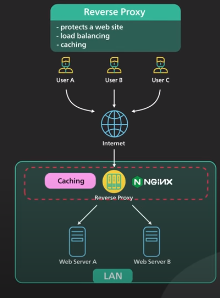

# Why is Nginx called a reverse proxy?

## Contents

- [Proxy Types](#proxy-types)
  - [Forward Proxy](#forward-proxy)
  - [Purpose of forward proxy?](#purpose-of-forward-proxy)
  - [Reverse Proxy](#reverse-proxy)
  - [Anycast](#antcast)
  - [Performance](#performance)
  - [Benefits](#benefits)
  - [References](#references)

## Proxy Types

2 types of proxy. Forward proxy and reverse proxy.

## Forward Proxy?

A forward proxy is a server that sits between a group of client machines and the internet. When those clients make request to websites on the internet, the forward proxy acts as a middleman intercepts those requests and talks to web servers on behalf of those client machines.

## Purpose of forward proxy?

1. A forward proxy protects the client's online identity. By using a forward proxy to connect to a website, the IP address of the client is hidden from the server. Only the IP address of proxy is visible. It would be harder to trace back to the client.
2. A forward proxy can be used to bypass browing restrictions. Some institutions like governments, schools, and big business use firewalls to restrict access to the internet. By connecting to a forward proxy outsite the firewalls, the client machine can potentailly get around these restrictions. It does not always work because the firewalls themeselves could block the connections to the proxy.
3. A forward proxy can be used to block access to certain content. This is not uncommon for schools and business to configure their networks to connect all clients to the web though a proxy and apply filtering rules to disallow sites like social networks. For large institutions usually apply a technique called transparent proxy to streamline the process. A transparent proxy works with layer 4 switches to redirect certain types of traffic to the proxy automatically.

## Reverse Proxy

A reverse proxy sits between the internet and the web servers. It intercepts the request from clients and talk to the web server on hehalf of the clients.

## Purpose of reverse proxy?

1. A reverse proxy could protect a website. The website's IP address are hidden behind the reverse proxy and are not revealed to the clients.This makes it much harder to target a DDoS attack against a website.

2. A reverse proxy is used for load balacing. A popular website handling milions of users everyday is unlikely to be able to handle the traffic with a single server. It can balance a large amount of incoming request by distributing the traffic to a large pool of web servers. and effectively preventing any single one of them becoming overloaded. Noted that this assumes that the reverse proxy can handle the incoming traffic. Services like cloudflare put reverse proxy servers in hundreds of locations all around the world. This puts the reverse proxy close to the users and at the same time provides a large amount of processing capaity.

3. A reverse proxy server caches static content.A piece of content could be cached on the reverse proxy for a period of time. If the same piece of content is requested again from the reverse proxy, the locally cached version could be quickly returened.

4. A reverse proxy can handle SSL encription. SSL handshaking is expensive. A reverse proxy can free up the origin servers from these expensive operations. Instead of handling SSL for all clients, a website only needs to handle SSL handshake from a small number of reverse proxies.

### Use-cases- it implements in many layers

1. The first layer could be an edge service like cloudflare. The reverse proxies are deployed to hundreds of locations worldwide close to the users.

2. The second layer could be an API gateway or load balancer at the hosting provider. Many cloud providers combine these two layers into a single ingress service. The user would enter the cloud network at the edge close to the user,and from the edge, the reverse proxy connects over a fast fiber network to the load balancer where the request is evenly distributed over a cluster of web servers.

## References

https://www.youtube.com/watch?v=4NB0NDtOwIQ
